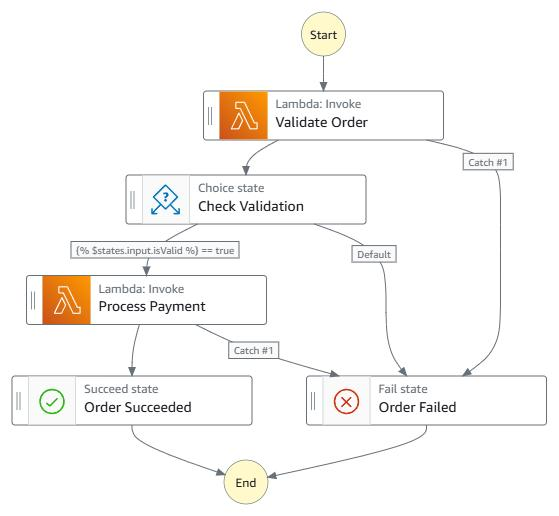
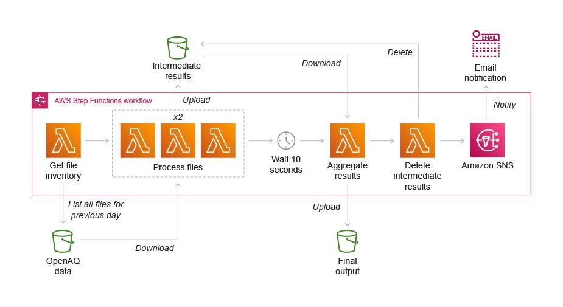
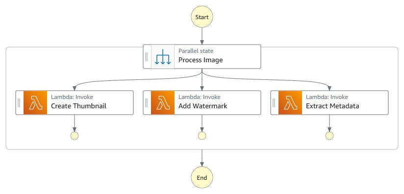
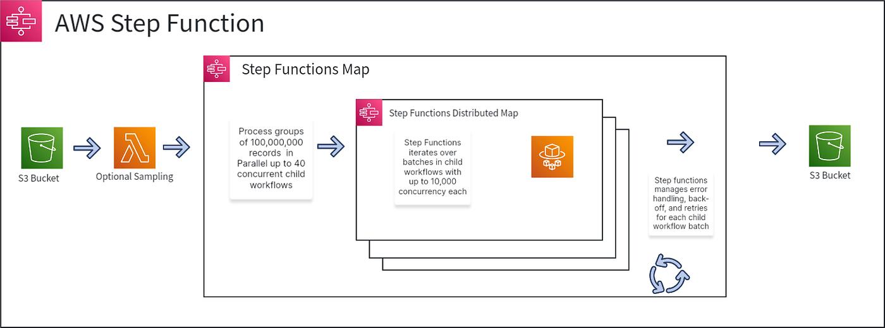
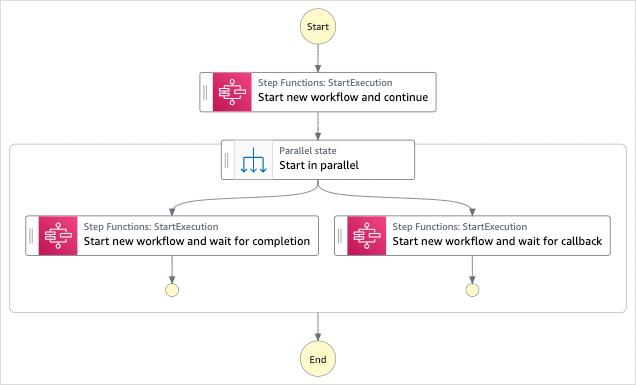
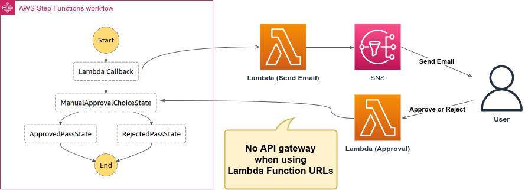
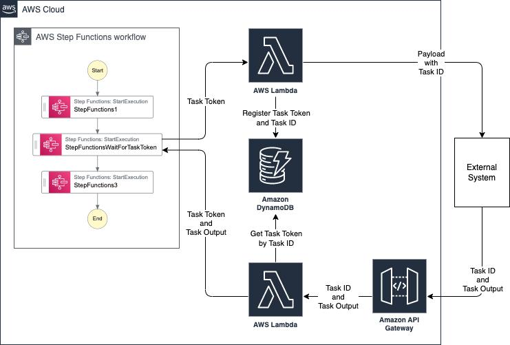
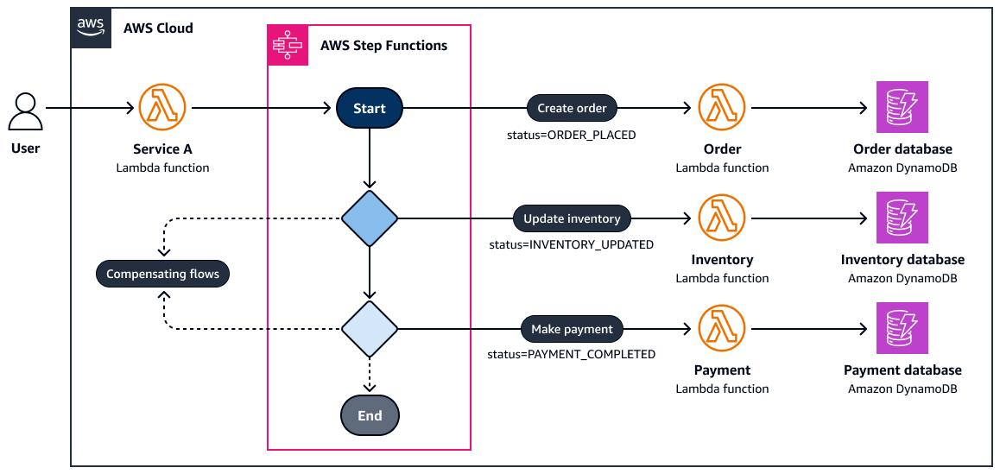

## 🧾 1. Basic Order Processing Workflow

💡 Flow Explanation
* API triggers workflow
* Step Function orchestrates:
- Payment processing (Lambda)
- Decision (Choice)
- Shipping + Notification (Parallel)
* Handles failure via cancellation

## 🔀 2. Parallel Processing Architecture

💡 Flow Explanation
* One input triggers multiple branches
* Each branch runs independently
* Results are merged after completion

👉 Useful for:

* Notifications
* Multi-service updates
* Data enrichment

## 🔁 3. Nested State Machine (RUN_JOB Pattern)

💡 Flow Explanation
* Parent workflow delegates complex logic
* Child workflow handles:
- Confirmation
- Notification
- Shipping

👉 Benefits:

* Reusability
* Cleaner main workflow
* Better separation of concerns

## ⏳ 4. Human Approval (WAIT_FOR_TASK_TOKEN)

💡 Flow Explanation
* Step Function pauses execution
* Sends approval request (email/API)
* External system responds with token
* Workflow resumes

👉 Used for:

* Approvals
* Manual review
* External async systems

## 🔄 5. Event-Driven Microservices Orchestration

💡 Flow Explanation
* API Gateway triggers Step Function
* Orchestrates multiple services:
- Lambda
- SQS/SNS
- Databases
* Ensures coordination instead of tight coupling

### 🧠 How to Read These Diagrams
Common symbols:

* 🟦 Rectangle → Task (Lambda/API)
* 🔷 Diamond → Choice (decision)
* 🟪 Split → Parallel execution
* ⏳ Clock → Wait state
* 🔁 Loop → Retry
* 🧾 Box → State Machine